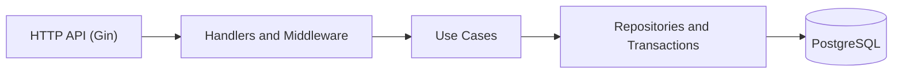

# Payslip Generation System

[](https://github.com/thomasdarmawan9/payslip-generation-system/actions/workflows/ci.yml)


A backend service for attendance, payroll processing, and payslip generation, built as a portfolio project with Go, Gin, GORM, PostgreSQL, JWT authentication, and Google Wire dependency injection.

The system models a realistic payroll workflow: employees submit attendance, overtime, and reimbursements; an administrator runs payroll once per period; and payslips use immutable payroll snapshots after processing.

## Engineering highlights

- Layered architecture: transport, handlers, use cases, repositories, and persistence.
- JWT-based authentication with role-based access for `admin` and `user`.
- Business-rule validation for weekdays, overtime limits, period overlap, and payroll locking.
- Transactional payroll execution with one payroll run per attendance period.
- Payslip snapshots so historical results do not change when employee data changes.
- Use-case unit tests with repository and transaction mocks.
- Swagger/OpenAPI documentation available during development.
- Configuration through environment variables with safe local examples.

## Architecture



Dependency injection is generated with Google Wire. Business rules remain in the use-case layer, while repositories are responsible for persistence.

## Core features

### Authentication and authorization

- Register and log in users with bcrypt password hashing.
- Issue JWT access tokens.
- Protect application routes with Bearer-token authentication.
- Restrict payroll administration endpoints to the `admin` role.

### Attendance and payroll

- Create non-overlapping attendance periods.
- Allow one attendance submission per weekday.
- Allow overtime submissions up to three hours per day.
- Allow multiple reimbursements per day.
- Run payroll once per period.
- Lock the period after payroll has been processed.
- Generate live payslips before payroll and snapshot-based payslips afterward.

## Technology stack

| Area | Technology |
| --- | --- |
| Language | Go 1.24.2 |
| HTTP framework | Gin |
| ORM and database | GORM and PostgreSQL |
| Authentication | JWT and bcrypt |
| Dependency injection | Google Wire |
| API documentation | Swaggo / Swagger UI |
| Testing | Go testing and Testify |
| Code quality | GitHub Actions, `go test`, and `go vet` |

## API overview

| Method | Endpoint | Access | Purpose |
| --- | --- | --- | --- |
| GET | `/health-check` | Public | Service health check |
| POST | `/v1/auth/register` | Public | Register a user |
| POST | `/v1/auth/login` | Public | Authenticate and receive a JWT |
| POST | `/v1/payroll/periods` | Admin | Create an attendance period |
| POST | `/v1/payroll/periods/:period_id/run` | Admin | Run payroll for a period |
| POST | `/v1/attendance/submit` | User/Admin | Submit attendance |
| POST | `/v1/overtime/submit` | User/Admin | Submit overtime |
| POST | `/v1/reimbursements` | User/Admin | Submit a reimbursement |
| GET | `/v1/payslips/periods/:period_id` | User/Admin | Generate a payslip |

The complete request and response schema is available in [Swagger JSON](docs/swagger.json) and [Swagger YAML](docs/swagger.yaml).

## Run locally

### Prerequisites

- Go 1.24.2
- PostgreSQL
- OpenSSL (to generate a local JWT secret)

### Setup

```bash
git clone https://github.com/thomasdarmawan9/payslip-generation-system.git
cd payslip-generation-system

createdb payslip-generation-system

cp .env.example .env
set -a
source .env
set +a

go mod download
go run .
```

The API starts at `http://localhost:9898`.

For local development, Swagger UI is available at:

```
http://localhost:9898/swagger/index.html
```

To generate Wire and Swagger artifacts again:

```bash
go generate ./...
```

> The application runs database auto-migrations for the payroll models. Use a dedicated local database and never commit production credentials.

## Configuration

| Variable | Required | Description |
| --- | --- | --- |
| `APP_MODE` | Yes | Use `dev` for local development. |
| `DATABASE_URL` | Yes | PostgreSQL connection string. |
| `JWT_SECRET` | Yes | Secret used to sign and validate JWTs. Use a unique value outside local development. |

The tracked `env/env_dev.yml` contains only a safe local fallback. Environment variables take precedence when `DATABASE_URL` and `JWT_SECRET` are provided.

Generate a strong local secret with:

```bash
openssl rand -base64 32
```

## Testing

```bash
go test ./...
go vet ./...
```

The tests focus on payroll calculations, period locking, weekend validation, idempotent submissions, and payslip behavior.

## Project structure

```text
.
├── config/              # Application, database, and router setup
├── internal/
│   ├── dto/             # Request and response contracts
│   ├── handler/         # HTTP handlers
│   ├── middleware/      # Authentication and role checks
│   ├── model/           # Persistence models
│   ├── repository/      # Database access and transactions
│   └── usecase/         # Business rules and unit tests
├── pkg/                 # Shared configuration, logging, and environment helpers
├── transport/            # HTTP server lifecycle and Swagger setup
├── docs/                # Generated OpenAPI documentation
├── .env.example         # Safe local environment template
└── postman.json         # API request collection
```

## API workflow example

1. Register and log in a user.
2. Create an attendance period as an administrator.
3. Submit attendance, overtime, and reimbursements.
4. Run payroll for the period.
5. Retrieve the generated payslip and verify that it uses the payroll snapshot.

This project is intended for learning and portfolio review. It is not a drop-in payroll solution without additional production hardening, compliance review, and operational controls.
